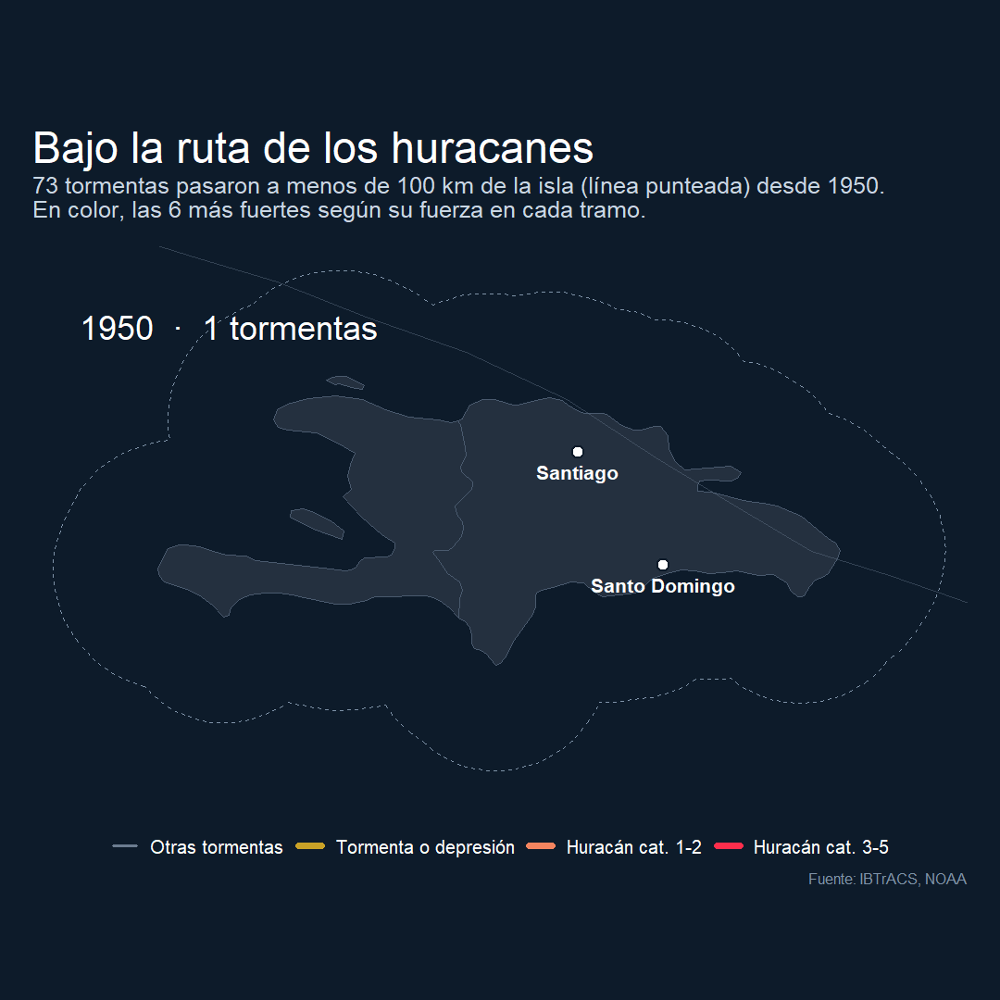
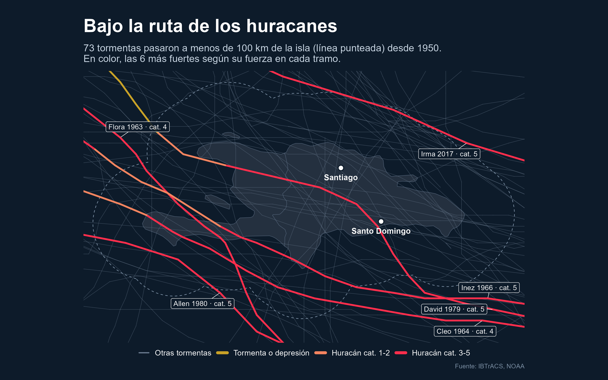

# Bajo la ruta de los huracanes

¿Cuántas tormentas han pasado cerca de La Española? Este proyecto reúne todas las tormentas y huracanes que pasaron a menos de 100 km de la isla desde 1950 y los muestra en un mapa y una animación año por año.

Es la segunda parte de una serie sobre los riesgos naturales de la isla. La primera, sobre sismos, está en [la-isla-que-tiembla](https://github.com/BraylinJR/la-isla-que-tiembla).



## Lo que muestran los datos

- **73 tormentas** pasaron a menos de 100 km de la isla desde 1950.
- **[X]** lo hicieron como huracán, y **[X]** como huracán mayor (categoría 3 a 5).
- **[X]** pasaron a menos de 100 km de Santo Domingo.
- **[Mes]** concentra el **[X]%** de los pasos.
- Entre los más fuertes están Flora (1963), Cleo (1964), Inez (1966), David (1979), Allen (1980) e Irma (2017).



## Cómo replicarlo

Instala los paquetes:

```r
install.packages(c(
  "readr", "dplyr", "tidyr", "stringr", "lubridate", "ggplot2", "ggrepel",
  "sf", "rnaturalearth", "rnaturalearthdata", "scales", "gganimate",
  "gifski", "av"
))
```

Luego corre `huracanes_isla.R`. El script:

1. Descarga el archivo del Atlántico Norte de IBTrACS si no está en la carpeta. Por su tamaño no se incluye en el repositorio.
2. Imprime en consola las cifras clave.
3. Guarda el mapa (`mapa_huracanes_isla.png`) y la animación en GIF y MP4.

En la sección `Parámetros` puedes cambiar el año de inicio, el radio alrededor de la isla y cuántos huracanes se destacan en color.

## Cómo leer el mapa

- **Línea punteada:** el área a 100 km de la costa. Las tormentas que la cruzan entran en el conteo.
- **Líneas grises:** todas las tormentas que pasaron por esa área.
- **Líneas de color:** los huracanes más fuertes. Cada tramo se colorea según la fuerza que tenía en ese momento, así se ve dónde se intensificaron o debilitaron.

## Archivos

| Archivo | Contenido |
|---|---|
| `huracanes_isla.R` | Script completo: datos, cifras, mapa y animación |
| `mapa_huracanes_isla.png` | Mapa estático con los huracanes más fuertes señalados |
| `huracanes_isla.gif` | Animación año por año |

## A tener en cuenta

- **Antes de los satélites muchas tormentas débiles no se registraban.** Por eso las décadas recientes parecen más activas, en parte porque hoy se mide mejor.
- **Pasar cerca no siempre significa causar daño.** El mapa muestra trayectorias, no impactos.
- La categoría indicada es la máxima que alcanzó cada tormenta dentro del radio de 100 km.

## Fuente

[IBTrACS](https://www.ncei.noaa.gov/products/international-best-track-archive), Administración Nacional Oceánica y Atmosférica de Estados Unidos (NOAA). Datos de dominio público.

## Autor

Braylin Jiménez · [LinkedIn](https://www.linkedin.com/in/tu-perfil)

Proyecto personal, hecho por curiosidad y por el gusto de aprender con datos públicos.
